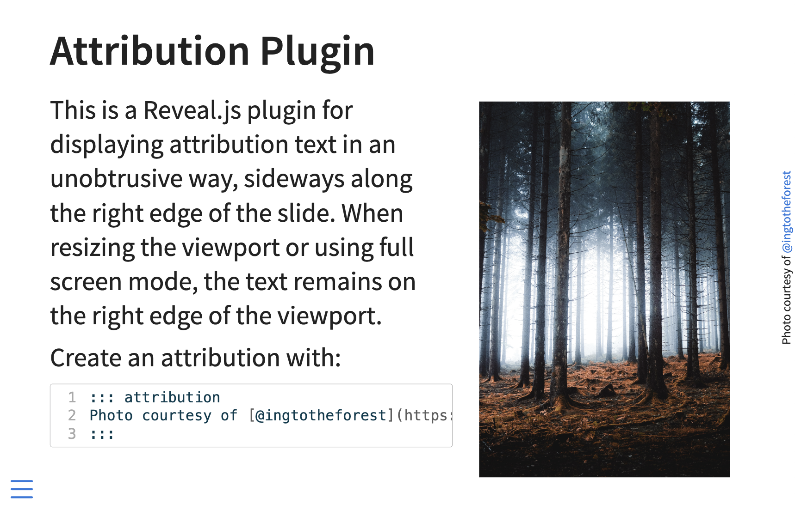

# attribution

A Revealjs plugin extension for displaying attribution text sideways along the right edge of the viewport. Based on the attribution plugin by [@rschmehl](https://github.com/rschmehl/reveal-plugins).

:warning: Requires Quarto Version 1.2.124 or later :warning:

## Installation

```
quarto install extension quarto-ext/attribution
```

This will install the extension under the `_extensions` subdirectory. If you're using version control, you will want to check in this directory.


## Usage:

Simply add the extension to the list of reveal plugins, for example:

```
title: My Presentation
format: 
  revealjs: default
revealjs-plugins:
  - attribution
```

Here's an example usage of the `attribution` plugin:




## Example

View the above example presentation at <https://quarto-ext.github.io/attribution/>. 

Source code for the example is available at [example.qmd](https://github.com/quarto-ext/attribution/blob/main/example.qmd).


